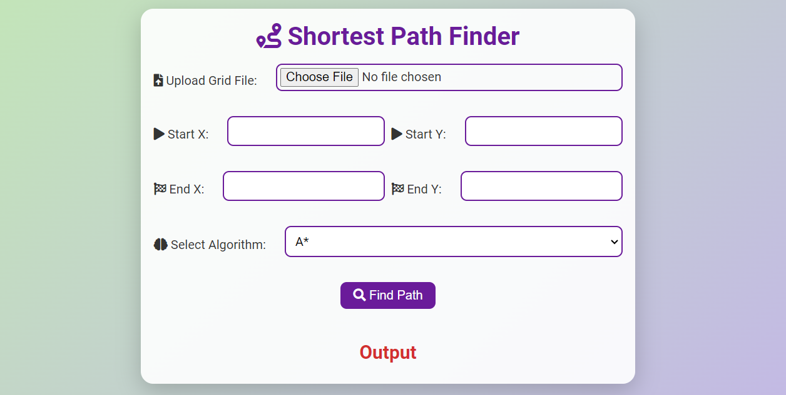

# Grid Traversal Algorithms

## Description

Grid Traversal is a web application that helps users find the shortest path in a grid using A\* or Greedy Best-First Search (GBFS) algorithms. Users can upload a grid file, specify start and end points, select the algorithm, and find the shortest path.

## Live Demo

Check out the live demo [here](https://hamzeh01.github.io/grid-navigation/).

## Features

- Upload a grid file.
- Specify start and end points.
- Choose between A\* and GBFS algorithms.
- Display the shortest path, cost, and runtime.

## Screenshot



## Installation

To run the project locally, follow these steps:

1. Clone the repository:
   ```sh
   git clone https://github.com/your-username/grid-navigation.git
   ```
2. Navigate to the project directory:
   ```sh
   cd grid-navigation
   ```
3. Open `index.html` in your browser.

## Usage

1. Upload a grid file (e.g., `grid.txt`).
2. Specify the start and end points.
3. Select the desired algorithm (A\* or GBFS).
4. Click the "Find Path" button to compute the shortest path.
5. The output section will display the path, cost, and runtime.

## License

This project is licensed under the MIT License - see the [LICENSE](LICENSE) file for details.

## Contributing

1. Fork the repository.
2. Create your feature branch (`git checkout -b feature/fooBar`).
3. Commit your changes (`git commit -am 'Add some fooBar'`).
4. Push to the branch (`git push origin feature/fooBar`).
5. Open a pull request.
